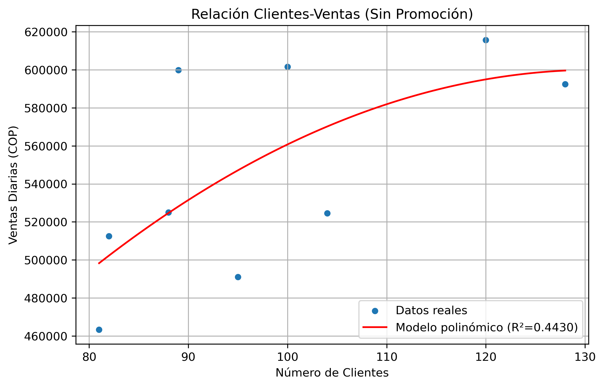
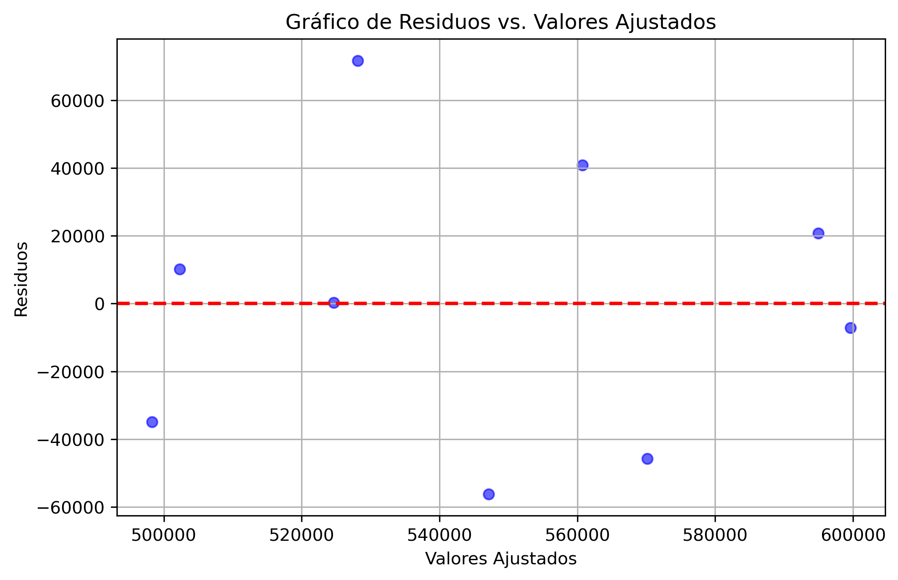
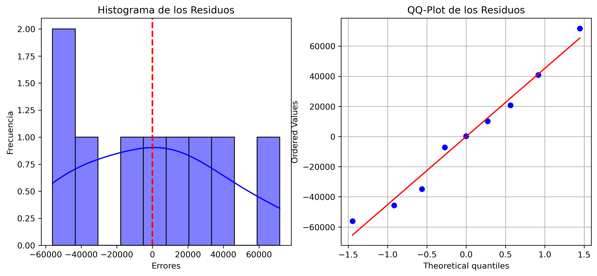

# Análisis de Ventas del Restaurante

Este proyecto analiza la relación entre el número de clientes y las ventas diarias en el restaurante, utilizando un modelo de regresión polinómica de grado 2. El objetivo es entender cómo la cantidad de clientes afecta a las ventas diarias en pesos colombianos (COP).

## 📊 Análisis Exploratorio de los Datos

A continuación, se muestran las gráficas de dispersión de los datos reales, junto con el modelo ajustado de regresión polinómica.

### Resultados del Modelo

- **R² (Coeficiente de Determinación):** El modelo tiene un R² de 0.443, lo que indica que el 44.3% de la variabilidad en las ventas se explica por la cantidad de clientes que visitan el restaurante en dias sin promociones.
- **r  (Coeficiente de Determinación):** El modelo tiene un r positivo de  0.666 por lo tanto se encuentra una relación positiva entre los clientes y las ventas, pero se puede evidenciar que no es lo suficientemente fuerte como para afirmar que el numero de clientes es el unico factor determinante.
- **X optimo (131 clientes):** Esto significa que cuando hay 131 clientes las ventas alcanzan su maximo de $790.609COP. Como el coeficiente cuadrático (β2=−40.408\beta_2 = -40.408β2​=−40.408) es negativo, la	
 parábola es cóncava hacia abajo, lo que confirma que este punto es un máximo a partir de aquí si suben los clientes no necesariamente suben las ventas	

  
- **Modelo de Regresión Polinómica (Grado 2):** Aunque el modelo tiene algunas limitaciones, sigue la tendencia general de los datos.

## 📈 Análisis de Intervalos de Confianza y Predicción

El modelo fue evaluado con intervalos de confianza al 95% y de predicción al 90%, mostrando su precisión y las posibles incertidumbres en el corto y largo plazo.

## 📉 Análisis de Residuos

Para verificar los supuestos del modelo, se realizaron varios análisis de residuos, incluyendo el análisis de normalidad, homocedasticidad, y la independencia de los residuos.

### Gráfico de Residuos vs Valores Ajustados:

### Histograma de Residuos:

## 🧮 ANOVA

Tipo de Modelo	Ecuación del modelo	fórmula general	ANOVA
Polinómico2	y=17.593X2 -4894.2 + 941559	y=ß2X²+ß1X+ßo	x ; x² ;  y

El análisis de la varianza (ANOVA) muestra que, con un p-valor menor que 0.05, se puede rechazar la hipótesis nula, lo que implica que el modelo tiene un efecto significativo en las ventas.

## 📊 Resultados Finales

- **Aleatoriedad e Independencia:** No se rechaza la independencia de los residuos, aunque hay incertidumbres relacionadas con la forma del modelo.
  
- **Normalidad:** Los residuos siguen una distribución normal, lo que valida la normalidad del modelo.
  
- **Igualdad de Varianzas (Homocedasticidad):** El p-valor obtenido indica que las varianzas son iguales, lo que valida el supuesto de homocedasticidad.

## 📝 Conclusiones

El modelo de regresión polinómica proporciona una aproximación válida de la relación entre el número de clientes y las ventas. Sin embargo, para mejorar la precisión del modelo, se recomienda agregar más variables explicativas (como la temporada del año, el día de la semana, y las horas de operación del restaurante). Aunque el modelo muestra algunas limitaciones, los resultados son útiles para una evaluación general del negocio.

---

## 📂 Archivos

Puedes encontrar los archivos utilizados en este proyecto en las siguientes carpetas:
- `imagenes/`: Contiene las imágenes generadas durante el análisis.
- `ventas-cafe.ipynb`: Notebook principal con todo el análisis paso a paso.
- `dirty_cafe_sales.csv`: Datos originales de las ventas diarias.

